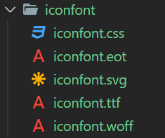
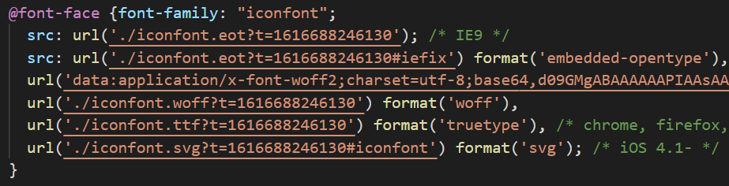
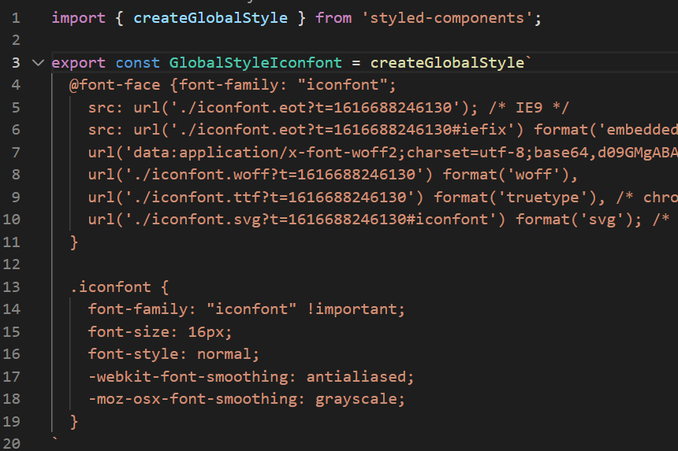
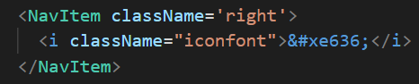

# React 简书项目实战

---

Table of Contents

- [React 简书项目实战](#react-简书项目实战)
  - [styled-components 与 Reset.css](#styled-components-与-resetcss)
    - [特性](#特性)
    - [基本用法](#基本用法)
    - [样式组件](#样式组件)
  - [Reset.css](#resetcss)
  - [使用 iconfont 嵌入头部图标](#使用-iconfont-嵌入头部图标)
  - [使用 react-transition-group 实现搜索框动画效果](#使用-react-transition-group-实现搜索框动画效果)
    - [CSSTransition 基本用法](#csstransition-基本用法)
  - [使用 React-Redux 进行应用数据的管理](#使用-react-redux-进行应用数据的管理)
  - [使用 combineReducers 完成对数据的拆分管理](#使用-combinereducers-完成对数据的拆分管理)
  - [actionCreators 与 constants 的拆分](#actioncreators-与-constants-的拆分)
  - [使用 immutable.js 来管理 store 中的数据](#使用-immutablejs-来管理-store-中的数据)
  - [使用 redux-immutable 统一数据格式](#使用-redux-immutable-统一数据格式)
  - [热门搜索样式布局](#热门搜索样式布局)
  - [Ajax获取推荐数据](#ajax获取推荐数据)
  - [代码优化微调](#代码优化微调)
  - [热门搜索换页功能实现](#热门搜索换页功能实现)
  - [换页旋转动画效果的实现](#换页旋转动画效果的实现)
  - [避免无意义的请求发送](#避免无意义的请求发送)

---

## styled-components 与 Reset.css

在使用`create-react-app`创建的项目中, 如果在一个地方以`import xxx.css`的形式导入某个样式文件, 这个样式文件会被所有的组件共享, 需要注意不同的样式文件中不要起相同的类名. 要想每个组件使用不同的样式文件, 我们可以借助于[`styled-components`](https://styled-components.com/).

### 特性

包括刚才说的, styled components 具有以下特性:

- **Automatic critical CSS**: 样式化组件跟踪页面上呈现的组件，并完全自动地注入它们的样式。
- **No class name bugs**: 为样式生成唯一的类名.
- **Easier deletion of CSS**: 很难知道样式文件中的某个类作用于代码中的哪个地方. styled-components 使得所有样式都紧密的与某个组件相关联, 很容易知道某个样式作用于哪里.
- **Simple dynamic styling**: 根据组件的props或全局主题调整组件的样式是简单而直观的，无需手动管理几十个类.
- **Painless maintenance**: 无需遍历其他文件来查找影响组件的样式，方便维护.
- **Automatic vendor prefixing**: 按照当前的标准编写CSS，然后让样式化的组件处理其余部分。

### 基本用法

第一步, 使用yarn安装`styled-components`依赖.

第二步, 编写样式组件.

第三步: 用样式组件将目标组件包裹起来.

### 样式组件

1. **Getting Started**: `styled-components` 使用 tagged template literals 来为组件定义样式. 当你定义样式时, 你是真的在创建一个普通的具有指定样式 React 组件. 如```const Thing = styled.div`color: blue;` ``` 创建了一个颜色为 blue 的 div 组件. [#](https://styled-components.com/docs/basics#getting-started)

2. **Adapting based on props**: 可以为一个 styled component 的 template literal 传入一些函数 (interpolations), 以根据props (styled component 是 react component) 来调整样式. 如: ``` const Button = `background: ${props => props.primary ? "red" : "blue"}` ``` [#](https://styled-components.com/docs/basics#adapting-based-on-props)

3. **Extending Styles**: 为了方便一个组件继承另一个组件的样式, 直接将另一个组件包裹在 `styled()` 构造器中即可, 如`const StyledComponent2 = styled(StyledComponent1)`. 在某些情况下，继承后的组件可能需要更改 styled component 渲染的目标标签或组件, 这时候可以使用`"as" polymorphic prop`, 如`<Button as='a' href="/">button</Button>` [#](https://styled-components.com/docs/basics#extending-styles)

4. **Styling any component**: `styled` 方法适用于所有的自定义的或者任何第三方组件, 只要他们将传入的 `className` 这一 prop 给到 DOM 元素上. [#](https://styled-components.com/docs/basics#styling-any-component)

5. **Passed props**: styled-components 会自动对传入的属性做区分, 如果添加样式的目标是基础元素, 会从传入的属性拆分出基本的 HTML 属性直接添加到元素上, 并将剩余属性作为 props 传递给 interpolation. [#](https://styled-components.com/docs/basics#passed-props)

6. **Pseudoelements, pseudoselectors, and nesting**: [#](https://styled-components.com/docs/basics#pseudoelements-pseudoselectors-and-nesting)
    1. ampersand (`&`) 可以用来引用组件本身.
        ```js
        const Thing = styled.div`
          color: blue

          &: hover {
            color: red;
          }

          & + & {
            background: line;
          }
        `
        ```
    2. 如果使用不带 `&` 的 selector, 他们会指向组件的孩子.
        ```js
        const Thing = styled.div`
          color: blue;

          .something {
            color: red;
          }
        `
        ```
    3. `&` 可以被用于提升组件的规则的 specificity.
        ```jsx
        const Thing = styled.div`
          && {
            color: blue;
          }
        `

        const GlobalStyle = createGlobalStyle`
          div${Thing} {
            color: red;
          }
        `

        render(
          <React.Fragment>
            <GlobalStyle />
            <Thing>
             I'm blue, da ba dee da ba daa
            </Thing>
          </React.Fragment>
        )
        ```

7. **Attaching additional props**: 为了避免不必要的只是向渲染组件传入某些 props 的嵌套, 可以使用 `.attrs` 构造器. 它使得你可以为一个组件附加多余的 props. 当多个样式组件嵌套或继承时子组件可以覆盖父组件的 `.attrs` 里重复的 props. [#](https://styled-components.com/docs/basics#attaching-additional-props)
    ```js
    const Input = styled.input.attrs(props => ({
      type: "text",
      size: props.size || "1em",
    }))`
      border: 2px solid palevioletred;
      margin: ${props => props.size};
      padding: ${props => props.size};
    `;

    // Input's attrs will be applied first, and then this attrs obj
    const PasswordInput = styled(Input).attrs({
      type: "password",
    })`
      // similarly, border will override Input's border
      border: 2px solid aqua;
    `;

    render(
      <div>
        <Input placeholder="A bigger text input" size="2em" />
        <br />
        {/* Notice we can still use the size attr from Input */}
        <PasswordInput placeholder="A bigger password input" size="2em" />
      </div>
    );
    ```

8. **Animations**: [#](https://styled-components.com/docs/basics#animations)

---

## Reset.css

为了保证页码在所有浏览器上的展示效果的一致性, 可以使用Reset.css, 覆盖掉浏览器默认样式. 直接把主页的css复制过来用就可以, 然后用`styled-components` 的 `createGlobalStyle` 设置为全局样式

一些相关文章:

- [到底该不该用 CSS reset?](https://www.zhihu.com/question/23554164/answer/34482613)
- [Reset.css](https://meyerweb.com/eric/tools/css/reset/)
- [Normalize.css](https://necolas.github.io/normalize.css/)
- [About normalize.css](http://nicolasgallagher.com/about-normalize-css/)
- [Applying Normalize.css Reset](https://blog.teamtreehouse.com/applying-normalize-css-reset-quick-tip)

---

## 使用 iconfont 嵌入头部图标

1. 网址: https://www.iconfont.cn/

2. iconfont 的一般使用方法有三种: Unicode, Font class 以及 Symbol, 使用方法在下载解压后的`demo_index.html`里都有详细.

3. iconfont 结合 styled-component 的使用方式:
   1. 图标下载到本地解压后, 只取`iconfont.css`, `iconfont.eot`, `iconfont.svg`, `iconfont.ttf` 以及 `iconfont.woff` 五个文件即可. (其他文件是和使用说明相关的)  
      

   2. 将`iconfont.css`中的绝对路径修改为相对路径. 并只保留`@font-family`和`.iconfont`  
     

   3. 将css改为styled-component的格式. 注意 iconfont 应该作为全局样式.  
     

   4. 挑选相应图标并获取字体变法, 应用于界面. 字体的unicode编码可以在`demo_index.html`中看到, 也可以在`iconfont.css` 或 iconfont网站上自己的对应项目中看到.
     

---

## 使用 react-transition-group 实现搜索框动画效果

### CSSTransition 基本用法

1. 网址: https://reactcommunity.org/react-transition-group/css-transition

2. 概述
    1. 暴露了组件 transition 的步骤, 使得用户可以在 transition 的不同阶段执行想要的操作
    2. 由四部分组成: `Transition`, `CSSTransition`, `SwitchTransition` 以及 `TransitionGroup`
    3. `Transition` 组件允许您使用简单的声明性API来描述一段时间内一个组件从状态到另一个状态的转换。常用于动画组件的安装和卸载，也可以用于描述原位过渡状态。
    4. `Transition` 组件是一个平台无关的组件. 如果使用CSS中的transition, 则最好使用`CSSTransition`. 后者继承了前者的所有功能, 并添加了 css transtiion 相关的其他功能.

3. 核心思想
    1. transition 有 enter 和 exit 两个过程, 每个过程有准备执行和执行中两个阶段, 为每个阶段提供了插入操作的hook.
    2. 四个阶段分别为:
        1. enter
        2. enter-active
        3. exit
        4. exit-active

4. `CSSTransition` 使用方式:
    1. `import {CSSTransition} from 'react-transition-group'`, 使用 `<CSSTransition>` 标签将要添加动画的组件包裹起来
    2. 为 `CSSTransition` 标签指定属性, 有三个最重要的属性: `classNames`, `in` 和 `timeout`
        ```jsx
        <CSSTransition in={inProp} timeout={200} classNames="my-node">
          <div>
            {"I'll receive my-node-* classes"}
          </div>
        </CSSTransition>
        ```
        1. CSSTransition forces a reflow between before adding the example-enter-active. This is an important trick because it allows us to transition between example-enter and example-enter-active even though they were added immediately one after another.
    3. 

---

## 使用 React-Redux 进行应用数据的管理

## 使用 combineReducers 完成对数据的拆分管理

## actionCreators 与 constants 的拆分

## 使用 immutable.js 来管理 store 中的数据

## 使用 redux-immutable 统一数据格式

## 热门搜索样式布局

## Ajax获取推荐数据

## 代码优化微调

## 热门搜索换页功能实现

## 换页旋转动画效果的实现

## 避免无意义的请求发送
