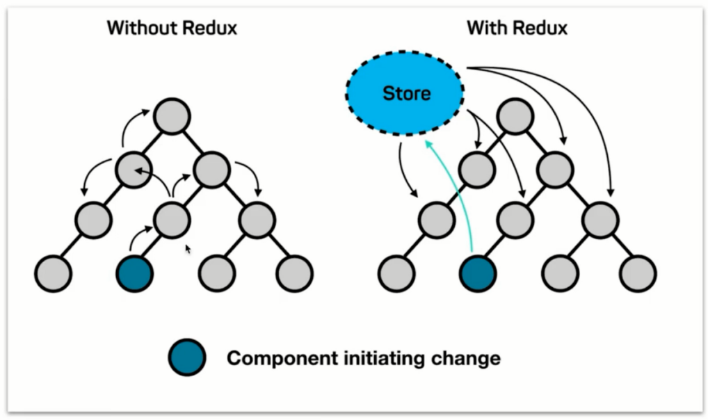
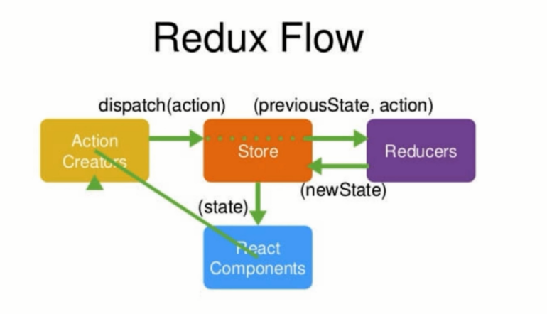

Redux
===

Table of Contents
---

- [Redux](#redux)
  - [Table of Contents](#table-of-contents)
  - [什么是 Redux](#什么是-redux)
  - [Redux 的工作流程](#redux-的工作流程)
  - [Redux DevTools](#redux-devtools)
  - [Store, Reducer 与获取 state](#store-reducer-与获取-state)
  - [Action 与修改 state (不使用 Action Creator)](#action-与修改-state-不使用-action-creator)
  - [ActionTypes的拆分](#actiontypes的拆分)
  - [使用 actionCreators 统一创建 action](#使用-actioncreators-统一创建-action)
  - [Redux 设计和使用的三项原则](#redux-设计和使用的三项原则)

---

什么是 Redux
---

组件很多时, 组件之间的数据传输很麻烦, 我们需要一个数据层框架. 目前最好的数据层框架是redux.

redux要求我们把所有的数据都放到公共的名为```Store```的存储区域. 当```Store```发生变化, 其他组件会感知知道. 有点像全局变量



Redux = **Red**ucer + Fl**ux**

Redux 的工作流程
---



Store: 图书馆管理员
React Components: 借书者
Action Creators: 说的"要借什么书"这句话
Reducers: 图书放置位置的记录本

读数据: React Component 向 Store 发出读数据的 Action Creator, Store 查阅 Reducers, 告诉 Components 数据在哪.

改数据: React Component 向 Store 发出改数据的 Action Creator, Store 查阅 Reducer 以获取改数据的方式, 改完数据后通知 Components.

Redux DevTools
---

1. 在chrome商店里找到这个插件, 安装
2. 修改代码中的```store```

  ```js
  const store = createStore(
      reducer,
      window.__REDUX_DEVTOOLS_EXTENSION__ && window.__REDUX_DEVTOOLS_EXTENSION__()
  );
  ```

Store, Reducer 与获取 state
---

1. 创建 Reducer, ```src/store/reducer.js```:

  最开始 Store 会给 Reducer 穿空参数, 此时设置 ```state``` 为自定义的 ```state```

  ```js
  const defaultState = {
      initialValue: 'initial value',
      list: ["c", "java", "javascript"],
  }

  export default (state = defaultState, action) => {
      return state;
  }
  ```

2. 利用 Reducer 创建 Store, ```src/store/index.js```:

  ```js
  import { createStore } from "redux"
  import reducer from './reducer'

  const store = createStore(reducer);

  export default store;
  ```

3. 获取Reducer中的数据: Reducer => Store => React Components, ```src/component/Todolist.js```

  ```js
  import {Component} from 'react'
  import store from '../store'

  class TodoList extends Component {
    constructor(props){
      super(props);
      this.state = store.getState()
    }
  }
  ```

Action 与修改 state (不使用 Action Creator)
---

在不使用 ation creator 的情况下, component 发出 action, 修改 state 的过程:

1. React Components (=> 不使用 Action Creators) => Store, ```src/component/Todolist.js```:

  ```js
  handleInputChange = (e) => {
    const action = {
      type: 'change_input_value',
      value: e.target.value,
    }
    store.dispatch(action);
  }
  ```

2. Store => Reducers => Store, ```src/store/reducer.js```:  
   Store 自动将 ```prevState``` 和 ```action``` 传递给 Reducer, Reducer 对 action 进行处理, 并返回新的 state 给 Store.

  ```js
  // reducer 可以接收 state, 但是绝不能修改 state.
  export default (state = defaultState, action) => {
      if(action.type === 'change_input_value') {
        const newState = JSON.parse(JSON.stringify(state));
        newState.inputValue = action.value;
        console.log(newState);
        return newState;
      }
      return state;
  }
  ```
   
3. Store => Component, ```src/component/TodoList.js```:

  组件监听数据发生的变化. 只要 Store 发生了变化, Component 就会重新从 Store 取一次数据, 替换 Component 中的数据.

  ```js
  componentDidMount = () => {
    store.subscribe(() => this.setState(store.getState()));
  }
  ```

ActionTypes的拆分
---

当 ation 的类型有很多时, component 代码中的 aciton 的 type 的单词容易写错, 写得和 reducer 内的判断逻辑不一致, 这种字符串错误也不会在控制台报错, 很难 debug.

为了解决上述问题, 引入了 ```actionTypes.js``` 文件:

```js
export const CHANGE_INPUT_VALUE = 'change_input_value';
export const ADD_TODO_ITEM = 'add_todo_item';
export const DELETE_TODO_ITEM = 'delete_todo_item';
```

之后再在 component 和 reducer 中引用即可.

这样一来, 如果单词拼错, 会直接报编译错误.

使用 actionCreators 统一创建 action
---

把 action 放在 actionCreators 里面统一管理. 提高了代码的可维护性, 方便自动化测试. component 文件中无需再导入 actionTypes.

1. 创建 action creators, ```src/store/actionCreators.js```:

  ```js
  import { CHANGE_INPUT_VALUE } from "./actionTypes";

  export const getInputChangeAction = (value) => ({
    type: CHANGE_INPUT_VALUE,
    value: value,
  })
  ```

2. 使用 action creators, ```src/component/TodoList.js```

  ```javascript
  import { getInputChangeAction } from "../store/actionCreators.js"

  handleInputChange = (e) => {
    const action = getInputChangeAction(e.target.value);
    store.dispatch(action);
  }
  ```

Redux 设计和使用的三项原则
---

1. store 是唯一的  
