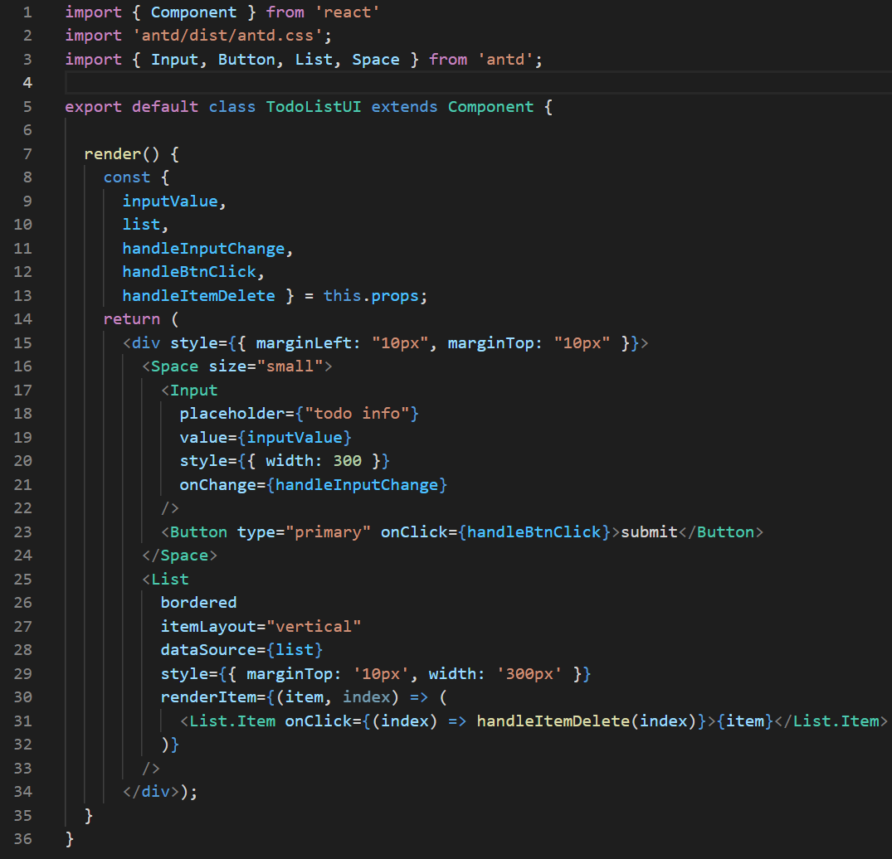
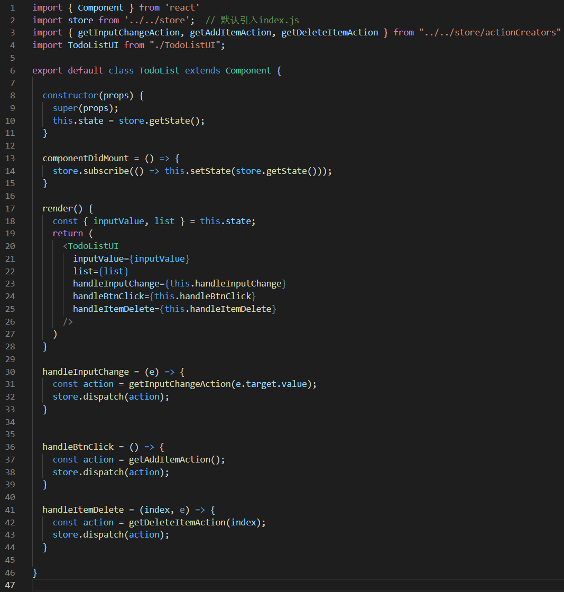
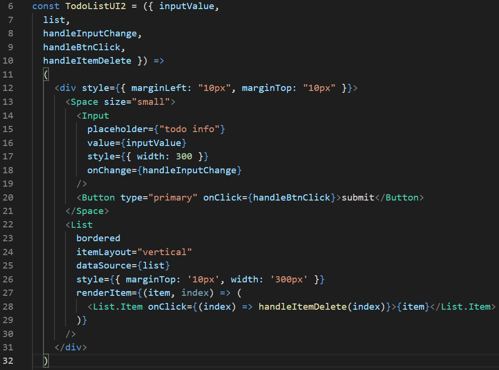
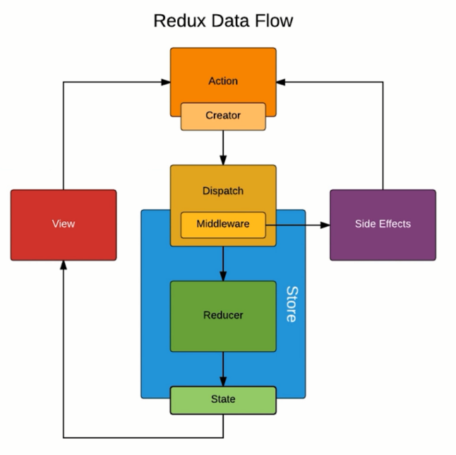

# Redux 进阶

## Table of Contents

- [Redux 进阶](#redux-进阶)
  - [Table of Contents](#table-of-contents)
  - [UI 组件和容器组件](#ui-组件和容器组件)
  - [无状态组件](#无状态组件)
  - [Redux 中发送异步请求获取数据](#redux-中发送异步请求获取数据)
  - [使用 Redux-thunk 中间件实现 ajax 数据请求](#使用-redux-thunk-中间件实现-ajax-数据请求)
  - [什么是 Redux 的中间件](#什么是-redux-的中间件)
  - [Redux-saga 中间件使用入门](#redux-saga-中间件使用入门)
  - [如何使用 React-Redux](#如何使用-react-redux)
  - [使用 React-redux 完成 TodoList 功能](#使用-react-redux-完成-todolist-功能)

## UI 组件和容器组件

有时候, 我们把一个组件的渲染(```render```)和逻辑(其他方法)都放到一个组件中时, 组件会很难维护, 此时我们需要对组件进行拆分, 将其拆分成UI组件(傻瓜组件)和容器组件(聪明组件). *UI组件*只负责页面的渲染, *容器组件*只负责业务逻辑和数据的处理. 数据和监听函数在容器组件中定义后通过props传递给UI组件.

UI组件:



容器组件:



## 无状态组件

当一个组件里的方法只有```render```时, 我们可以将其写成一个函数, 称之为无状态组件. 上面定义的UI组件可以写成一个无状态组件, 它可以写成下面这样的函数形式:



无状态组件的优势在于它的性能比较高, 因为它就是一个简单函数, 而我们之前定义的组件是一个类.

## Redux 中发送异步请求获取数据

```js
componentDidMount = () => {
  store.subscribe(() => this.setState(store.getState()));
  axios.get("http://localhost:3000/data")
    .then((res) => {
      const data = res.data;
      const action = getInitListAction(data);
      store.dispatch(action);
    })
}
```

## 使用 Redux-thunk 中间件实现 ajax 数据请求

如果把一些异步的请求或者非常复杂的逻辑, 都放到组件中实现, 这个组件有时会显得过于臃肿, 我们希望这些代码移到统一的地方进行管理. [redux-thunk](https://github.com/reduxjs/redux-thunk) 这个中间件可以让我们把这些异步请求或复杂逻辑放到action中进行处理.

步骤一: 启用 Redux Thunk (同时也启动 Redux DevTools) :

```js
/* store.js */
import { createStore, applyMiddleware, compose } from "redux"
import reducer from './reducer'
import thunk from "redux-thunk"

const composeEnhancers = window.__REDUX_DEVTOOLS_EXTENSION_COMPOSE__ || compose;
const store = createStore(
  reducer,
  composeEnhancers(
    applyMiddleware(
      thunk
    )
  )
);

export default store;;
```

步骤二: 正常情况下, actionCreator 应该返回一个对象. 用了 thunk 之后, 它可以返回一个函数了. 我们可以把复杂逻辑放到这个函数里. 这个函数有一个参数```dispatch```, 相当于```store.dispatch```. 我们在这个函数里写逻辑继续dispatch其他action来修改state即可.

```js
/* actionCreators.js */
export const getTodoList = () => {
  return (dispatch) => {
    axios.get("http://localhost:3000/data")
      .then((res) => {
        const data = res.data;
        const action = getInitListAction(data);
        dispatch(action);
      })
  }
}
```

步骤三: 之后在 component 中像普通 action 那样使用即可.

```js
/* TodoList.jsx */
componentDidMount = () => {
  store.subscribe(() => this.setState(store.getState()));
  const action = getTodoList();
  store.dispatch(action);
}
```

除了可以简化组件外, 这种方式还十分利于自动化测试.

## 什么是 Redux 的中间件



Redux 中间件是位于 Action 和 Store 之间. 不使用中间件时, action 是一个对象, 直接派发给 store. 有了中间件后, action可以是函数了, 这个函数实际上就是对```store.dispatch```的封装. dispatch 可以区分对象和函数. dispatch 一个函数, 不会直接将它传给 store, 它会直接让函数执行.

除了 *redux-thunker* 外, 还有 *redux-logger* (可以记录 action 每次发送的日志), *redux-saga* (类似 *redux-thunker*)等.

## Redux-saga 中间件使用入门

[*redux-saga*](https://github.com/corupta/redux-saga) 类似 *redux-thunker*, 但 *redux-thunker* 是把异步操作放入action中, redux-saga 的设计思路是单独将异步操作拆分出来放到专门的文件中进行管理

步骤一: 配置saga中间件

```js
/* store/index.jx */
import { createStore, applyMiddleware, compose } from "redux"
import reducer from './reducer'
import createSagaMiddleware from "redux-saga"
import todoSagas from './sagas'

const sagaMiddleware = createSagaMiddleware();
const composeEnhancers = window.__REDUX_DEVTOOLS_EXTENSION_COMPOSE__ || compose;
const store = createStore(
  reducer,
  composeEnhancers(
    applyMiddleware(
     sagaMiddleware 
    )
  )
);

sagaMiddleware.run(todoSagas);

export default store;
```

步骤二, 创建 ```saga.js```, export default 一个 **generator**. ```takeEvery(actionType, worker)```会捕捉每一个action类型, 并执行对应方法```worker```. ```worker``` 可以是普通函数, 也可以是 generator, 最好用 generator (注意在 generator 中 ajax 不必使用 promise). 在```worker```中我们可以继续 dispatch action, 但不是用的```store.dispatch```, 也不是像 redux-thunk 那样会通过参数传入 ```dispatch``` 方法, 而是通过导入 ```reeux-saga/effects``` 中的 ```put``` 来进行dispatch.

```js
/* sagas.js */
import { takeEvery, put } from "redux-saga/effects"
import { GET_INIT_LIST }  from './actionTypes'
import axios from "axios"
import { initListAction } from './actionCreators'

function* getInitList() {
  try{
    const res = yield axios.get("http://localhost:3000/data");
    const action = initListAction(res.data);
    yield put(action);
  } catch(e) {
    console.error("list request error!")
  }
}}

function* mySaga() {
  //console.log("mysaga");
  // 捕捉每一个action类型, 执行对应方法. 之前只能在reducer内捕获action类型
  yield takeEvery(GET_INIT_LIST, getInitList);
}

export default mySaga;
```

步骤三: 创建 mySaga 要捕获的 action 类型的 action creator.

```js
import { GET_INIT_LIST } from "./actionTypes"
export const getInitListAction = () => ({
  type: GET_INIT_LIST
})
```

与 *redux-thunk* 相比, 他们都添加了中间 action, 通过发送中间 action 间接发送最终所需要的 action. 但是, *redux-thunk* 使得 store 不但可以 dispatch 一个对象, 还可以直接 dispatch 一个函数, 我们将异步请求或复杂逻辑放到这个函数形式的 action 中, 然后在这个 action 中继续 dispatch 最终所需的会直接改变状态的 action. 而使用 *redux-saga* 后, store 依旧是只能 dispatch 对象, 但是 *redux-saga* 可以捕获指定 type 的 action, 并执行对应的方法, 在这个方法中通过自己的```put```方法来继续 dispatch aciton.

此外, *redux-saga* 要比 *redux-thunk* 复杂得多, 它具有非常丰富的 API.

## 如何使用 React-Redux

*React-Redux* 是一个第三方模块, 可以帮助我们在 *React* 中更方便的使用 *Redux*.

第一个核心 API, ```Provider```. 用它来将需要使用 store 的组件们包裹起来, 通过它连接 store, 连接之后其内部组件都有能力获取到 store:

```js
/* App.js */
import TodoList from "./components/react-redux/TodoList"
import { Provider } from 'react-redux'
import store from './store';

function App() {
  return (
    <Provider store={store}>
      <TodoList/>
      <A/>
      <B/>
    </Provider>
  );
}

export default App;
}
```

第二步, 从```react-redux```中导入```connect```, 利用```connect```和两个后续创建的映射规则创建连接, 将```TodoList```组件包裹起来. 不再直接导出```TodoList```, 而是导出包裹后的. ```TodoList```中也无需再导入```store```并调用```store.subscribe(this.setState)```, 不再通过```this.state```访问, 而是通过```this.props```来访问. props 是两个映射结果的合并.

```js
import { connect } from 'react-redux'

class TodoList extends Component {
  render(){
    const { inputValue, list } = this.props;
    return (
      <div>
        <div>
          <input value={inputValue} onChange={this.props.changeInputValue}/>
          <button>提交</button>
        </div>
        <ul>
          {list.map((entry, i) => <li key={i}>{entry}</li>)}
        </ul>
      </div>)
  }
}

export default connect(mapStateToProps, mapDispatchToProps)(TodoList);
```

第三步, 定义第一个映射规则. 创建一个函数, 这个函数用于将 state 映射为 props, 这个函数可命名为```mapStateToProps```.

```js
/* Todolist.jsx */
const mapStateToProps = (state) => {
  return {
    inputValue: state.inputValue,
    list: state.list,
  }
}
```

第四步, 定义第二个映射规则. 创建一个函数, 这个函数用于将 state 映射为 props, 这个函数可命名为```mapDispatchToProps```. ```dispatch``` 其实就是 ```store.dispatch```. component 中我们不再导入 store, 我们只能从这个函数中间接使用```store.dispatch```来修改 state. 由于 state 在这里被修改, 所以事件监听函数也放在这里, 再作为 props 传给 component.

```js
const mapDispatchToProps = (dispatch) => {
  return {
    changeInputValue(e){
      const action = createChangeInputValueAction(e.target.value);
      dispatch(action)
    }
  }
}
````

## 使用 React-redux 完成 TodoList 功能
