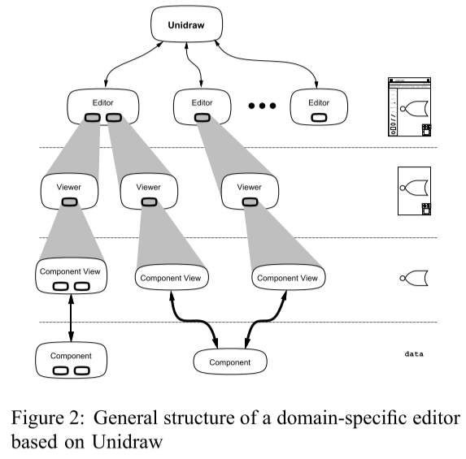

# Title

Unidraw: A Framework for Building Domain-Specific Graphical Editors

## Introduction 

Unidraw 是一个用于创建面向对象的，domain-specific 的图形编辑器（如艺术绘画，音乐谱曲和CAD等）的框架。

## Contribution

Unidraw 通过提供领域间通用的编程抽象，简化了这些编辑器的构建。在传统用户界面工具和图形对象编辑器的实现需求之间架起了桥梁。

## Methods

Unidraw 定义了四个基本抽象：

1. Components: 封装了领域对象的外观和行为。如音乐谱曲中的音符，绘画编辑器中的几何图形。
2. Tools: 支持对 component 的直接操纵。Tool 利用动画和其他视觉效果来提供即时反馈，使得用户感觉他在处理真实的物体。
3. Commands: 定义了 components 和其他对象上的操作。Commands 是有状态的，可被执行和反向执行(undo)的，由对象来解释的。比如修改物体的颜色。
4. External representation: 定义了component到一个文件或数据库的映射（转化）。用于将信息以其他组织存储方式导出编辑器。

### Overview

#### Subject and View

Unidraw 将 components 分为两部分：subject 对象和 view 对象。前者定义了对象的状态和操作，后者定义了对象在某个环境中的外观表示。一个subject可以有多个view，当 subject 状态发生改变时，会通知所有对应的 view，view 响应通知来修改自己的状态和表现。比如，对于一个电路中的逻辑门组件，需要有一个subject对象来保存什么其他组件连接到了它以及输入值等信息。对于这一个subject，可能有多个view，比如一个view用来绘制逻辑符号（可能还会定义当一个tool操纵它时的语义），另一个view提供 external representation。

#### General structure of a domain-specific editor based on Unidraw

自底向上有五层：
1. **Component subject**： 注意最左边的 component 是个组合 component。
2. **Component view**：注意最右边的 component subject 有两个 view。
3. **Viewer**：用于具体展示 component view， 支持 “non-semantic” 的操作如滚动和放缩。Viewer 通常采用原始windows系统或工具的事件，并对这些事件进行转化，使之符合标准的Unidraw通信协议。
4. **Editor**: 将Tools和用户可访问的command 与一个或多个 viewer 结合起来，做成一个一致的用户界面。
   1. 一个Editor维护了一个**selection**对象，用来管理用户当前感兴趣的 component view。
5. **Unidraw**：坐落于系统的最顶层，一个独一无二的对象。
   1. 一些Editor之间的通信和协同的操作，需要访问Unidraw对象。这些操作包括开启或关闭Editor，退出应用程序。
   2. 维护了一个日志，用来记录被执行和反向执行的 commands，支持任意层级的 undo 和 redo。

除了图中展示的，还有一个特殊的对象，被称为**catalog**。它管理了一个components，commands和tools的数据库。一个 domain-specific editor 至少用它来命名、存储和检索component。一个编辑器同样可以访问没使用的command和tool，并且将他们在运行时结合进界面。

### Components

一个 component 定义了一个 domain-specific 对象的外观和行为。一个 component 的行为有三个方面：
1. 如何对 command 和 tool 进行响应。
2. 连通性（connectivity）
3. 如何与其他组件通信

### Tools

### Commands

### External Reperesentation

## Related Work

## Methods

## Conclusion 

## Evaluation?

## Drawbacks?

## Commnets?